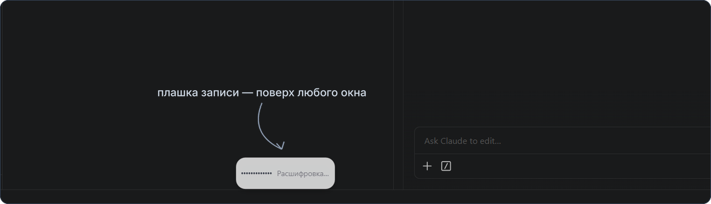
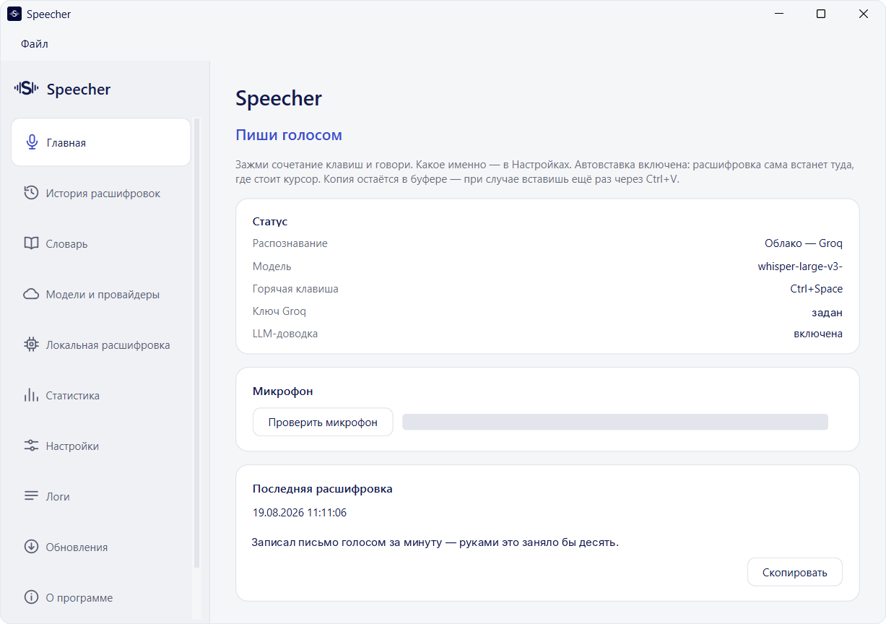
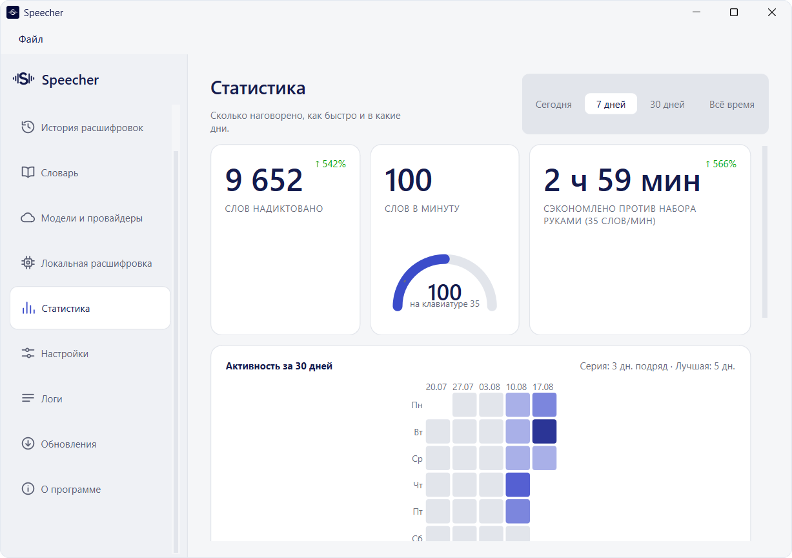
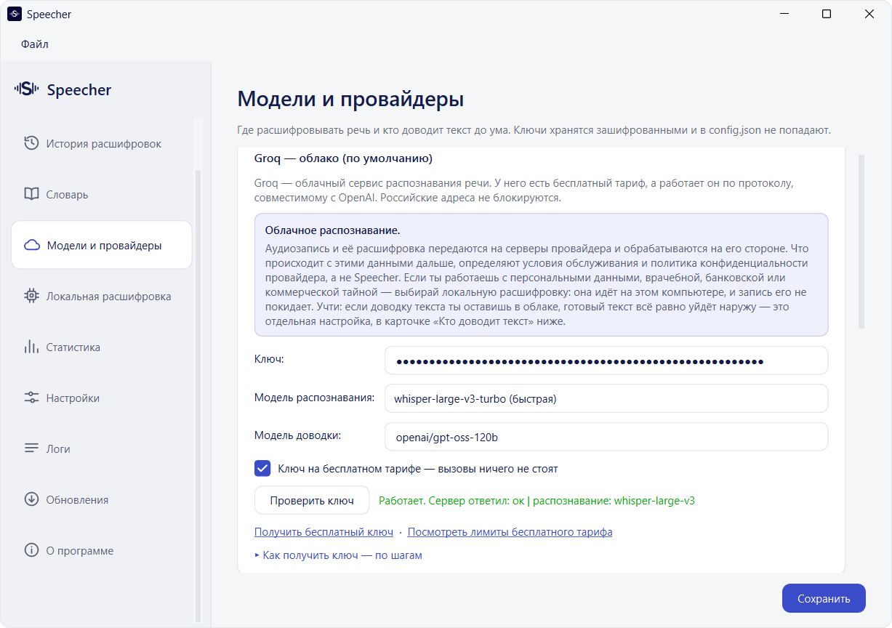
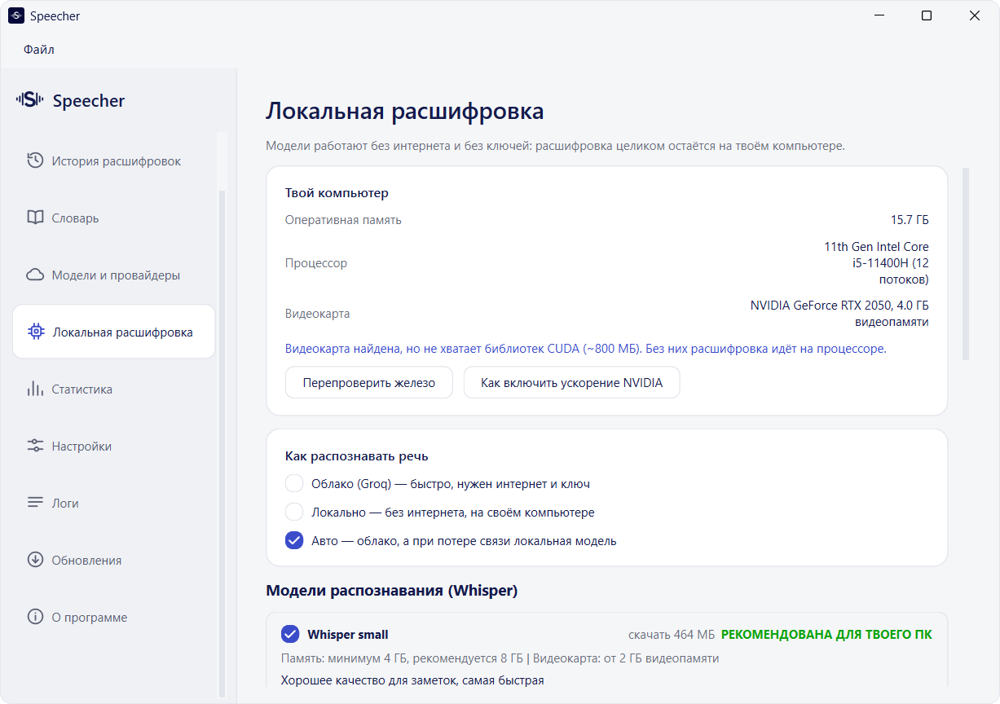
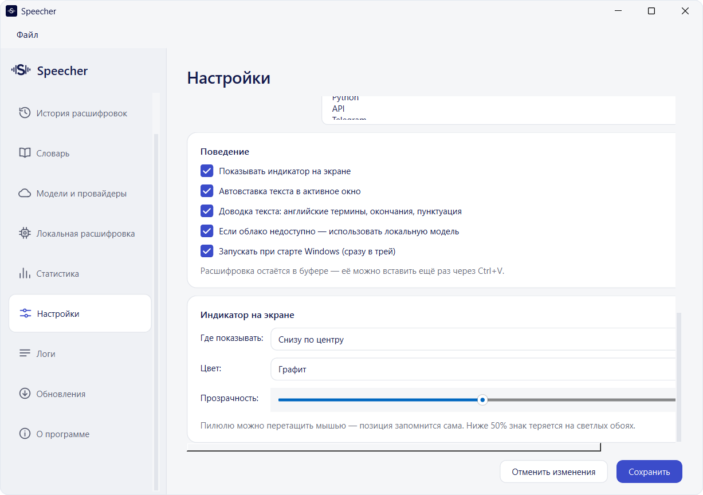
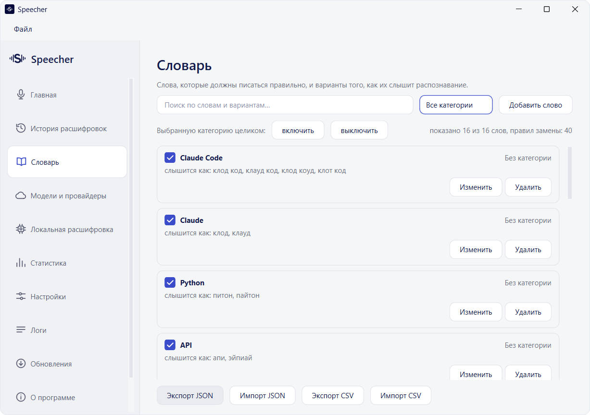

<p align="center">
  
</p>

<p align="center">
  <a href="https://github.com/Ai-Solutions-Pro/speecher-releases/releases/latest"></a>
  
  
  
</p>

<p align="center"><strong>Зажми клавишу и скажи фразу — она транскрибируется в текст.</strong></p>

Speecher — голосовой ввод для Windows. Работает поверх любого окна: письмо в браузере, сообщение в мессенджере, промпт в редакторе кода, комментарий в таблице. Пока клавиша зажата — идёт запись, отпустил — расшифровка сама встаёт туда, где стоит курсор. Копия остаётся в буфере обмена, так что вставить ещё раз через `Ctrl+V` можно в любой момент.

Распознаёт Whisper. Где именно он работает — решаешь ты: в облаке на бесплатном тарифе, на своём компьютере без интернета вообще или на твоём собственном сервере. Программа бесплатная, телеметрии в ней нет.

<p align="center">
  <a href="https://github.com/Ai-Solutions-Pro/speecher-releases/releases/latest">
    
  </a>
</p>

<p align="center"><sub>~95 МБ · Windows 10/11 · без прав администратора · <a href="https://github.com/Ai-Solutions-Pro/speecher-releases/releases">все версии и контрольные суммы</a></sub></p>

<p align="center">
  
</p>

---

<p align="center">
  <a href="assets/shot-home.png"></a>
  <a href="assets/shot-stats.png"></a>
</p>
<p align="center">
  <a href="assets/shot-providers.png"></a>
  <a href="assets/shot-local.png"></a>
</p>

<p align="center"><sub>Главное окно · статистика · провайдеры · локальные модели</sub></p>

---

## Как это работает

1. Ставишь курсор туда, где нужен текст — в письмо, в чат, в поле поиска.
2. Нажимаешь и **держишь** горячую клавишу. Внизу экрана появляется плашка с эквалайзером: волна живёт от твоего голоса, рядом идёт секундомер.
3. Говоришь. Отпускаешь — плашка показывает «Расшифровка…».
4. Текст встаёт в активное окно сам. Копия остаётся в буфере.

**Автовставку можно выключить одной галочкой** — тогда текст только ложится в буфер, и ты вставляешь его сам, когда решишь.

Горячая клавиша — любая: сочетание, одиночная клавиша или готовый пресет. `Ctrl+Space`, правый `Ctrl`, правый `Alt`, `F9`, двойной `Ctrl` — выбираешь в два клика.

<p align="center">
  <a href="assets/shot-settings.png"></a>
</p>

---

## Три способа расшифровки — выбираешь ты

Программа не привязана к одному сервису. Режим переключается в настройках в любой момент, менять ничего больше не нужно.

| Способ | Кому подходит | Что нужно |
|---|---|---|
| **Облако Groq** *(по умолчанию)* | Всем, кто хочет просто работать. В РФ нужен VPN | Бесплатный ключ. Лимитов хватает на повседневную диктовку с запасом |
| **Локально, на своём компьютере** | Работе с персональными данными, врачебной, банковской и коммерческой тайной | Один раз скачать модель. Интернет дальше не нужен, звук не покидает компьютер |
| **Свой endpoint** | Тем, кто знает, чего хочет | Адрес OpenAI-совместимого сервера, модель и ключ. Годится и собственный сервер в локальной сети |

**Модель подбирается под твоё железо.** Программа сама смотрит память, процессор и видеокарту и помечает ту, которая пойдёт на этом компьютере. Видеокарту NVIDIA найдёт и задействует, но справится и на одном процессоре.

**Авторежим на случай обрыва.** Отдельная галочка: работать через облако, а когда связи нет — молча переключиться на локальную модель. Расшифровку ты получаешь в обоих случаях.

---

## Что ещё умеет

| | |
|---|---|
| **Смешанная речь** | Говоришь по-русски с английскими терминами — так и запишется. Отмечаешь языки, на которых говоришь, остальное программа делает сама |
| **Доводка текста** | Убирает «эээ» и «ммм», расставляет знаки препинания, чинит окончания. Своя настройка: локальная модель, облако, свой сервер или выключить |
| **Личный словарь** | Правила замен для имён и терминов: «клод код» станет `Claude Code`, «питон» — `Python`. Работает офлайн в любом режиме, категории включаются и выключаются целиком, импорт и экспорт в JSON и CSV |
| **История расшифровок** | Всё, что наговорил, с поиском по тексту и копированием в один клик. Хранится локально |
| **Статистика** | Сколько слов надиктовано, сколько слов в минуту выходит против набора руками и сколько времени это сэкономило. С календарём активности |
| **Логи вызовов** | Провайдер, модель, время ответа, токены и стоимость — по каждому вызову отдельно |
| **Трей и автозапуск** | Поднимается вместе с Windows сразу в трей. Можно отключить в настройках. |
| **Индикатор под себя** | Плашку можно перетащить мышью в любой угол, сменить цвет и прозрачность. Позиция запоминается |

<p align="center">
  <a href="assets/shot-dictionary.png"></a>
</p>

---

## Установка

1. Скачай `SpeecherSetup-X.Y.Z.exe` со [страницы релизов](https://github.com/Ai-Solutions-Pro/speecher-releases/releases/latest) — файл лежит в разделе **Assets**.
2. Запусти. Права администратора не нужны.
3. Установщик спросит, качать ли модели для офлайн-распознавания. Можно отказаться и скачать позже из самой программы.
4. Открой «Модели и провайдеры», вставь ключ Groq и нажми «Проверить ключ» — он делает живой запрос, а не проверку формата строки.

**Про синее окно Windows.** SmartScreen скажет «Windows защитила ваш компьютер» — так он встречает любую программу без платной подписи. Нажми **Подробнее** → **Выполнить в любом случае**. Именно поэтому к каждому релизу приложены контрольные суммы: подпись стоит денег, а хеш проверяется бесплатно.

---

## Проверка скачанного файла

К каждому релизу приложен `SHA256SUMS.txt`. Открой PowerShell в папке со скачанным файлом:

```powershell
Get-FileHash .\SpeecherSetup-1.2.1.exe -Algorithm SHA256
```

Строка в ответе должна совпасть с той, что лежит в `SHA256SUMS.txt`. Совпала — файл дошёл ровно таким, каким я его собрал. Не совпала — не запускай.

---

## Приватность

Программа слушает микрофон, поэтому по пунктам и без общих слов.

| Что | Где живёт |
|---|---|
| **Запись** | Идёт только пока зажата клавиша. Отпустил — остановилась. Фонового прослушивания нет |
| **Звук** | Уходит во временный файл, оттуда на распознавание и удаляется сразу — в том числе если распознавание упало с ошибкой. Архива записей на диске не остаётся |
| **Куда уходит звук** | Ровно тому провайдеру, которого ты выбрал, и никому больше. В локальном режиме не покидает компьютер |
| **История, словарь, настройки** | `%LOCALAPPDATA%\Speecher` на твоём компьютере. Обычная база SQLite, чистится из окна программы |
| **Ключи API** | Зашифрованы средствами Windows (DPAPI). Расшифровать их может только твой пользователь на твоей машине. В открытом виде на диск не пишутся и в логи не попадают |
| **Журнал вызовов** | Только служебные цифры: провайдер, модель, время, токены, стоимость. Текстов расшифровок в нём нет |

**Когда хотя бы одно звено обработки облачное, программа говорит об этом прямо в настройках и спрашивает согласие.** «Локальным» режим называется только тогда, когда локальны оба звена — и распознавание, и доводка текста.

---

## Чего Speecher не делает никогда

- не пишет звук в фоне — микрофон открывается на время удержания клавиши;
- не хранит аудиозаписи после расшифровки;
- не отправляет текст никуда, кроме выбранного тобой провайдера;
- не собирает телеметрию: ни статистики использования, ни отчётов о падениях, ни счётчика установок;
- не требует прав администратора;
- не молчит об ошибке — если провайдер не ответил, это видно в статусе.

Сама, без твоего участия, программа обращается ровно в два места: `huggingface.co` — скачать модель для офлайна, если ты её попросил, и `api.github.com` — проверить, не вышла ли новая версия. Запрос за обновлением уходит без единого идентификатора: только имя и номер версии.

---

## Обновление

Программа проверяет новые версии сама раз в сутки и предлагает обновиться. Ставишь руками — просто запусти новый установщик поверх, удалять ничего не нужно. История, словарь, ключи, настройки и скачанные модели лежат отдельно от программы и переустановку переживают.

Что изменилось в каждой версии — на [странице релизов](https://github.com/Ai-Solutions-Pro/speecher-releases/releases).

---

## Кто это делает

Speecher я делаю сам, для себя и своих задач — а раз получилось, пусть пользуются все. Про то, как он устроен изнутри, что ломалось по дороге и что я вообще собираю из нейросетей, пишу здесь:

- **Instagram** — [@ai_solutions.pro](https://www.instagram.com/ai_solutions.pro/)
- **Telegram** — [@Ai_solutions_PR0](https://t.me/Ai_solutions_PR0)

Заходи, если интересно. Там же проще всего написать, если Speecher пригодился, чего-то не хватает или что-то пошло не так.

---

## Нашёл проблему с безопасностью

Не открывай публичный Issue — напиши лично через вкладку **Security** → **Report a vulnerability**. Подробности в [SECURITY.md](SECURITY.md).

---

## Условия использования

Speecher бесплатный, но не открытый: здесь раздаются готовые сборки, исходный код не публикуется, все права на программу принадлежат автору.

**Можно** — пользоваться бесплатно, в том числе на работе, и ставить на любое число своих компьютеров.
**Нельзя** — продавать, распространять изменённые сборки, вскрывать программу и выкладывать её со своих зеркал.

Программа поставляется «как есть», без гарантий: автор не отвечает за последствия её использования и не обязан выпускать обновления или отвечать на обращения. Сторонние сервисы распознавания ты подключаешь сам и пользуешься ими на их условиях.

Полный текст — [LICENSE.md](LICENSE.md).
